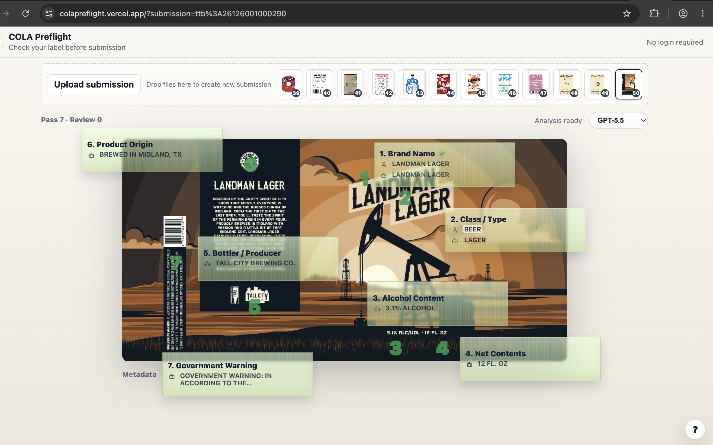
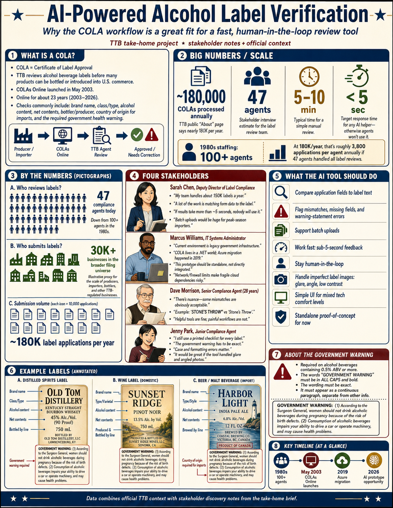

# COLA Preflight

## What it is

COLA Preflight is a no-login pre-submission checker for alcohol beverage labels.

It helps producers and importers catch obvious COLA issues before submitting to TTB, reducing avoidable review burden. The prototype keeps the workflow focused on a single label check with read-only sticky notes overlaid directly on the image.

This prototype is intentionally minimal: the label is the interface.





## Why

The prototype reduces invalid COLA submissions upstream and gives reviewers a faster visual verification layer downstream. It focuses on the high-volume visual matching work: brand, class/type, alcohol content, net contents, bottler/producer, origin, and government warning.

## How to run

Open `index.html` in a browser, or run a static server:

```sh
python3 -m http.server 8000
```

Then visit `http://localhost:8000`.

For live AI mode, run the included Node server instead:

```sh
OPENAI_API_KEY=your_key_here node server.js
```

Then visit `http://localhost:8000/?ai=1`.

You can also put the key in a local `.env` file:

```sh
OPENAI_API_KEY=your_key_here
```

Then run:

```sh
node server.js
```

## Mock mode

The app defaults to the `Local` engine. Local uses vendored Tesseract.js files from `vendor/tesseract/` to OCR the label in the browser, then applies JavaScript field heuristics over Tesseract word and line bounding boxes.

## Public Sample

The built-in sample uses 50 real public COLA submissions downloaded from the TTB Public COLA Registry into `test-images/ttb-public-sample/`. The fixture set contains 80 label images:

- 1 image: 22 submissions
- 2 images: 26 submissions
- 3 images: 2 submissions

The upload area shows a thumbnail queue of submissions. Clicking a thumbnail loads the whole submission, stitches its label images into one masonry-style sheet, and writes its id to the URL as `?submission=...`, so refreshing keeps the same submission. Dropping or uploading multiple images creates one new submission at the front of the queue.

## API mode

Run `server.js` with an `OPENAI_API_KEY` server-side environment variable and open `/?ai=1`. The browser never receives an API key.

The engine selector in the status strip has two choices: `Local` and `GPT-5.5`. `Local` runs browser-side Tesseract OCR with JavaScript field extraction; Tesseract runtime, worker, WASM core, and English traineddata are served from this repo. To start on GPT-5.5, pass `?engine=openai:gpt-5.5`.

Speed-related environment overrides:

```sh
OPENAI_VISION_MODEL=gpt-5.5
OPENAI_IMAGE_DETAIL=auto
OPENAI_MAX_OUTPUT_TOKENS=1200
```

Request contract:

```json
{
  "imageBase64": "data:image/jpeg;base64,...",
  "mode": "applicant",
  "model": "gpt-5.5",
  "applicationData": null
}
```

Successful OpenAI responses are cached on disk in `cache/openai-label-analysis/`. The cache key includes the image bytes, mode, application metadata, selected model, image detail, max output tokens, prompt, schema, and cache version, so repeat submissions avoid duplicate API usage while prompt/schema changes invalidate old entries.

## Architecture

Vanilla HTML/CSS/JS, SVG overlays, normalized bounding boxes, Scroll serialization, and a small optional serverless API hook. The central state object lives in `app.js`; field constants live in `sampleData.js`; local validation and API switching live in `ai.js`; overlay math and callouts live in `overlay.js`; Scroll output lives in `scroll.js`.

## Read-Only Checks

The sticky notes stay on the label and summarize each extracted check. There are no correction forms, applicant/reviewer modes, or reviewer action buttons in this prototype.

## Assumptions

Prototype only. Not official TTB guidance. Does not replace human review. No data is stored in the prototype. Government warning validation is simplified to catch title-case or missing `GOVERNMENT WARNING:` headings.

## Limitations

OCR/vision may be wrong. Bounding boxes may be approximate. API performance depends on the model and hosting environment. The prototype does not include login, persistence, batch upload, a reviewer queue, audit logging, or COLAs Online integration.
